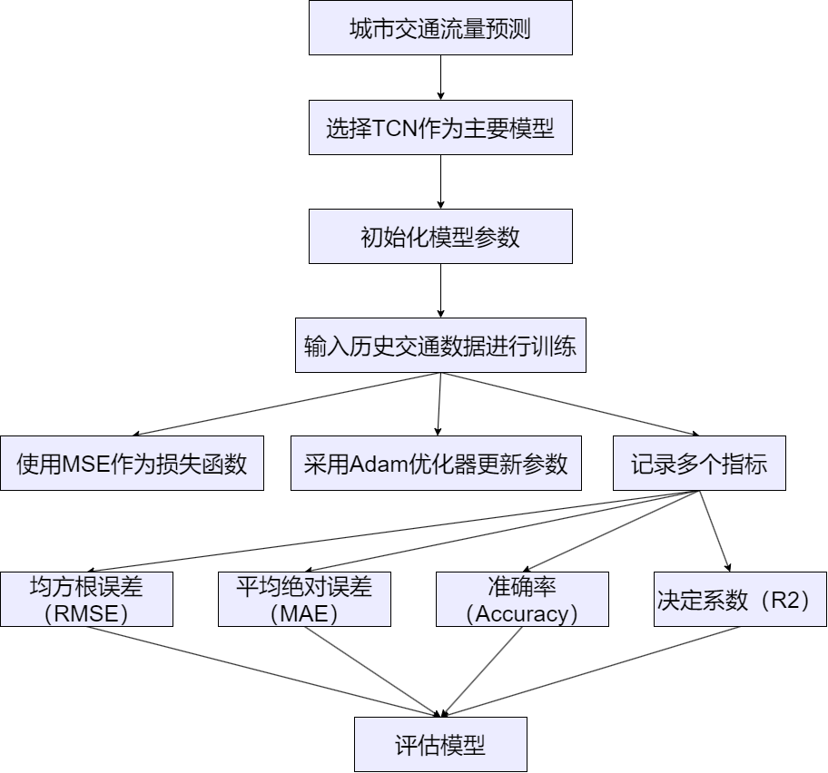
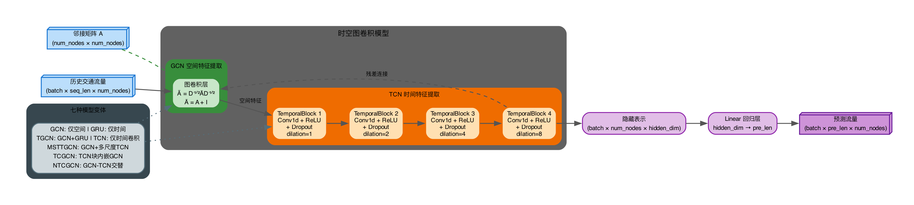
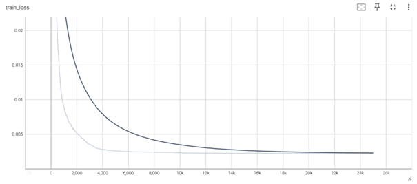
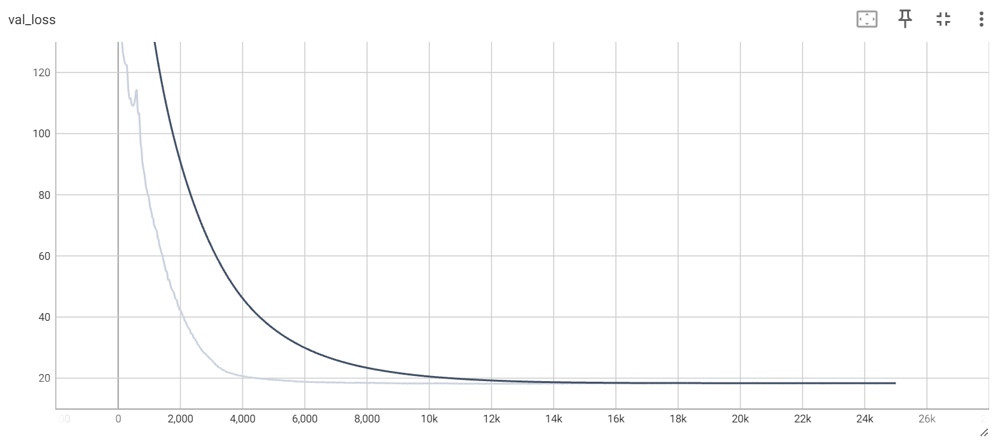
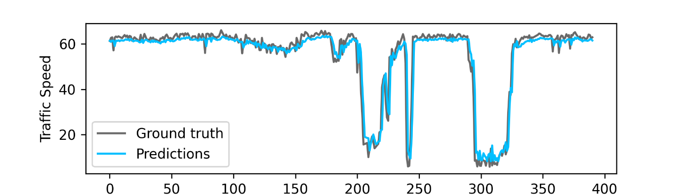
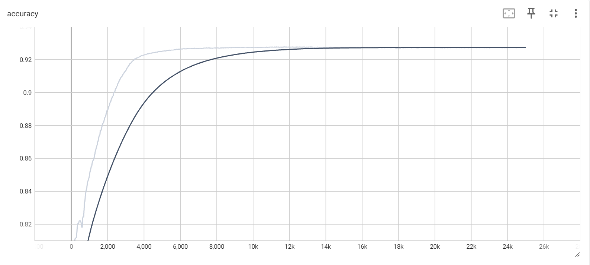
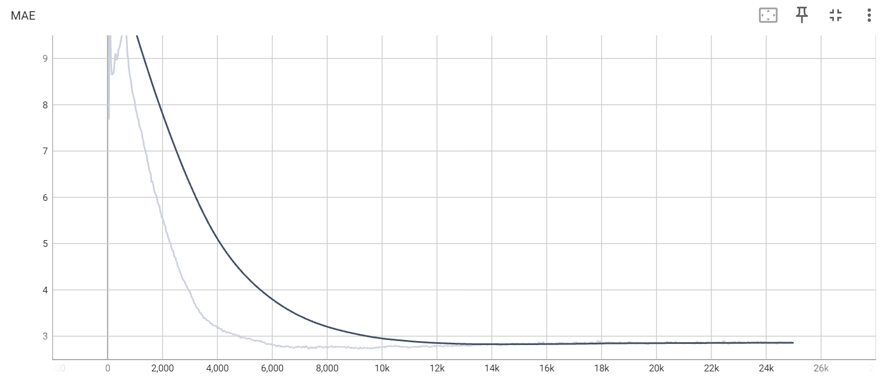
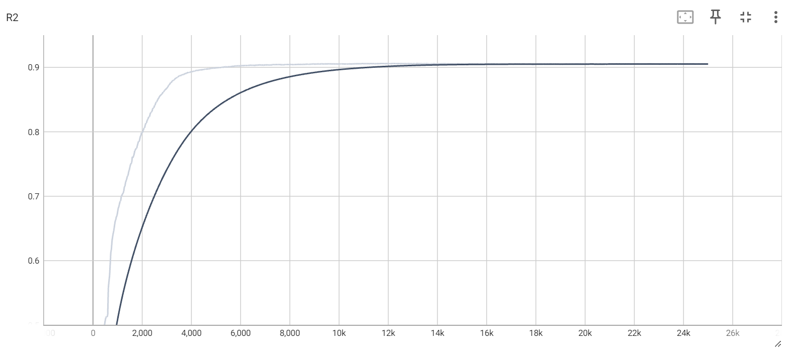

# GCN-tffc

交通流量预测引擎。基于 PyTorch Lightning 实现的时空图卷积神经网络模型库，用于从历史交通流量数据中学习时空依赖关系，预测未来时间片的交通流量。实现了 GCN、GRU、TGCN、TCN、MSTTGCN、TCGCN、NTCGCN 七种模型变体，支持横向对比评估与模型选型。

## 问题定义

交通流量预测可建模为时空序列预测任务：给定过去 `seq_len` 个时间步的交通流量观测值（每个时间步包含 `num_nodes` 个传感器/路段的流量），预测未来 `pre_len` 个时间步的流量值。空间维度上，道路网络被建模为图 `G = (V, E)`，其中节点为传感器/路段，边表示道路连接关系，邻接矩阵 `A ∈ R^(N×N)` 编码了图的结构信息。

## 模型构建



> **图片类型：** 技术设计图。模型构建过程：从历史交通数据开始，经过数据预处理（清洗、归一化）、特征提取、邻接矩阵构建，输入 TCN 模型训练，最终输出预测结果。

### 设计思路

交通流数据具有双重依赖结构：时间维度上，当前流量与历史流量相关（时序依赖）；空间维度上，相邻路段的流量相互影响（空间依赖）。本模块的方案是将图卷积网络（GCN）与时间卷积网络（TCN）结合——GCN 通过邻接矩阵聚合邻居节点信息捕获空间依赖；TCN 通过扩张卷积与残差连接，以对数级层数获得线性级感受野，捕获长程时间依赖。

### 模型架构



> **图片类型：** 技术设计图。输入为历史交通流量张量（batch × seq_len × num_nodes）与邻接矩阵（num_nodes × num_nodes）。模型主体由 GCN 层（空间特征提取）与 TCN 层（时间特征提取）交替堆叠组成，扩张卷积提供指数级感受野增长，残差连接缓解梯度退化。输出经过 Linear 回归层映射到预测时间步。

### TCN 的设计优势

TCN 的两项关键设计使其在时序建模上优于 RNN 系模型：**扩张卷积**使感受野随层数指数增长（`dilation = 2^i`），4 层即可覆盖 16 个时间步的依赖；**残差连接**允许梯度直通浅层，缓解深层网络的退化问题。此外，TCN 的卷积操作天然支持并行计算，训练速度显著优于 RNN 的串行递归。

### 模型变体

| 模型 | 空间建模 | 时间建模 | 结构特点 |
| ---- | -------- | -------- | -------- |
| **GCN** | 两层图卷积 | 无 | 纯空间基线 |
| **GRU** | 无 | 门控循环单元 | 纯时间基线 |
| **TGCN** | 图卷积嵌入 GRU | GRU | GCN 替换 GRU 门控中的全连接层 |
| **TCN** | 无 | 扩张卷积 + 残差 | 4 层 TemporalBlock，扩张率 1→2→4→8 |
| **MSTTGCN** | 前置 GCN | 多尺度 TCN | 多分支 TCN 捕获不同时间粒度 |
| **TCGCN** | 内嵌 GCN | 扩张卷积 | 每个 TemporalBlock 输出端嵌入 GCN 层 |
| **NTCGCN** | 前置 GCN 交替 | 扩张卷积 | GCN-TCN 交替堆叠 |

### TCGCN 结构详解

每个 TemporalBlock 由两个 `weight_norm` 一维卷积层 + `Chomp1d`（裁剪 padding）+ `ReLU` + `Dropout` 组成，卷积层间通过残差连接跨层传递。在 TemporalBlock 输出端，将特征张量转置后送入 GCN 层执行空间图卷积。堆叠多个 TemporalBlock 时，扩张率按 `2^i` 指数增长。

## 模型验证与评估

### 训练过程





> TensorBoard 监控的训练损失和验证损失曲线。随着训练迭代次数增加，训练损失和验证损失逐渐减小并收敛，表明模型在训练集和验证集上都取得了良好的拟合效果。

### 评估指标









> 模型在验证集上的评估结果：预测结果与真实值的对比、准确率（Accuracy）、平均绝对误差（MAE）和 R² 分数均达到了令人满意的性能。

## 训练流程

### 数据预处理

1. **缺失值填补：** 线性插值填充时间序列中的缺失值
2. **特征工程：** 提取平均流量、最大/最小流量、流量变化率等统计特征
3. **邻接矩阵构建：** 基于道路网络拓扑结构，将路段连接关系转化为归一化拉普拉斯矩阵
4. **时间序列划分：** 按时间顺序划分训练集与验证集，避免时间泄漏
5. **归一化：** 最大最小归一化至 [0, 1]，训练后反归一化恢复原始量纲

### 训练配置

| 参数 | 默认值 | 说明 |
| ---- | ------ | ---- |
| `seq_len` | 12 | 输入序列长度（历史观测窗口） |
| `pre_len` | 3 | 预测长度（预测时间步） |
| `batch_size` | 32 | 批次大小 |
| `hidden_dim` | 64 | 隐藏层维度 |
| `tcn_len` | 4 | TCN 块深度 |
| `tcn_wid` | 10 | TCN 块通道数 |
| `learning_rate` | 1e-3 | 初始学习率 |
| `weight_decay` | 1.5e-3 | 权重衰减（L2 正则化） |
| `max_epochs` | 1000 | 最大训练轮数 |

### 损失函数与优化器

- 损失函数：MSE（均方误差），支持 L2 正则化变体
- 优化器：Adam
- 评估指标：RMSE、MAE、Accuracy、R²、Explained Variance
- 模型选择：基于验证集 `train_loss` 的 `ModelCheckpoint` 保存最佳模型

## 数据集

| 数据集 | 速度文件 | 邻接矩阵 | 来源 |
| ------ | -------- | -------- | ---- |
| LosLoop | `data/los_speed.csv` | `data/los_adj.csv` | 洛杉矶环路检测器 |
| Shenzhen | `data/sz_speed.csv` | `data/sz_adj.csv` | 深圳交通传感器网络 |
| Wenyi | `data/wenyi_speed.csv` | `data/wenyi_adj.csv` | 文一路段数据 |

数据格式：速度 CSV 中每行为一个时间步，每列为一个传感器节点。邻接矩阵 CSV 为 N×N 二维矩阵，0 表示无连接，非零值表示连接权重。

## 依赖

| 组件 | 版本 | 用途 |
| ---- | ---- | ---- |
| Python | 3.12 | 运行环境 |
| PyTorch | 1.10.2 | 深度学习框架 |
| PyTorch Lightning | 1.5.10 | 训练框架 |
| NumPy | 1.19.5 | 数值计算 |
| Pandas | 1.1.5 | 数据处理 |
| SciPy | 1.5.4 | 稀疏矩阵（图拉普拉斯） |
| Matplotlib | 3.3.4 | 可视化 |
| TorchMetrics | 0.8.2 | 评估指标 |

## 本地开发

### 前置条件

- Python 3.12+
- 数据文件存放于 `data/` 目录

### 安装依赖

```bash
cd GCN-tffc
pip install torch pytorch-lightning numpy pandas scipy matplotlib torchmetrics python-dotenv
```

### 运行训练

```bash
python main.py \
    --data losloop \
    --model_name TCGCN \
    --settings supervised \
    --seq_len 12 \
    --pre_len 3 \
    --batch_size 32 \
    --hidden_dim 64 \
    --tcn_len 4 \
    --tcn_wid 10 \
    --max_epochs 100
```

训练过程中监控 TensorBoard：

```bash
tensorboard --logdir lightning_logs/
```

### 命令行参数

| 参数 | 类型 | 可选值 | 默认值 |
| ---- | ---- | ------ | ------ |
| `--data` | str | shenzhen, losloop, wenyi, allday | losloop |
| `--model_name` | str | GCN, GRU, TGCN, TCN, MSTTGCN, TCGCN, NTCGCN | TCN |
| `--settings` | str | supervised | supervised |
| `--seq_len` | int | — | 12 |
| `--pre_len` | int | — | 3 |
| `--batch_size` | int | — | 32 |
| `--hidden_dim` | int | — | 64 |
| `--tcn_len` | int | — | 4 |
| `--tcn_wid` | int | — | 10 |
| `--lr` | float | — | 1e-3 |
| `--weight_decay` | float | — | 1.5e-3 |
| `--max_epochs` | int | — | 1000 |
| `--send_email` | flag | — | false |

## 项目结构

```
GCN-tffc/
├── main.py                  # 训练入口，CLI 参数解析
├── models/                  # 模型定义（GCN, GRU, TGCN, TCN, MSTTGCN, TCGCN, NTCGCN）
├── tasks/
│   └── supervised.py        # LightningModule 训练/验证逻辑
├── utils/
│   ├── data/                # 数据加载与预处理
│   ├── callbacks/           # 训练回调（绘图、最佳epoch记录）
│   ├── graph_conv.py        # 图拉普拉斯矩阵计算
│   ├── metrics.py           # Accuracy, R², Explained Variance
│   ├── losses.py            # MSE + L2 正则化
│   ├── logging.py           # 日志格式化
│   └── email.py             # 邮件通知
└── data/                    # 数据集文件
```