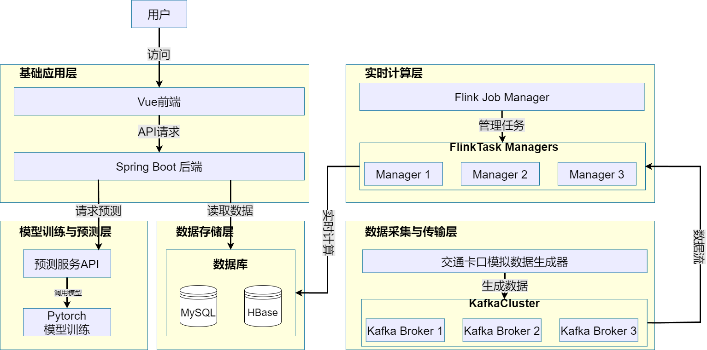
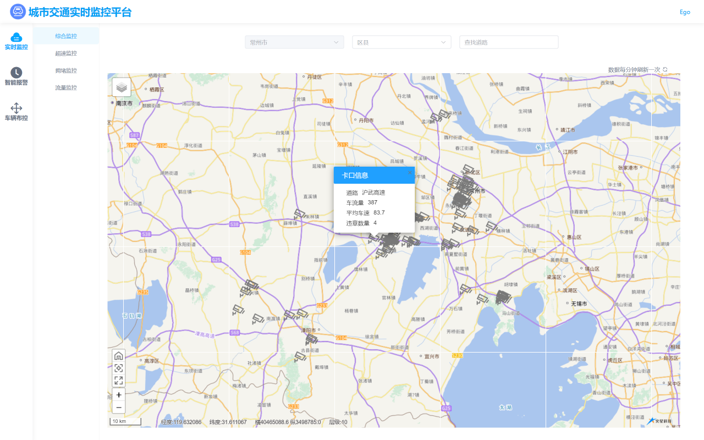
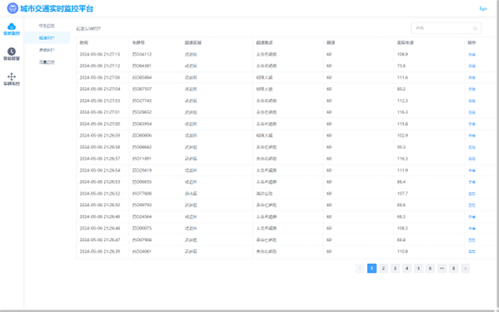
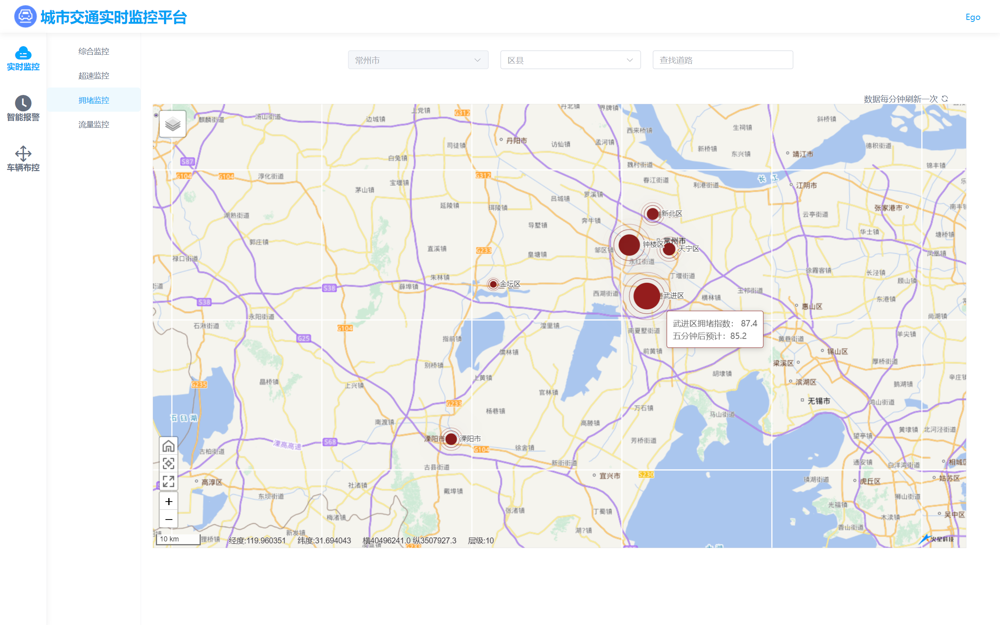
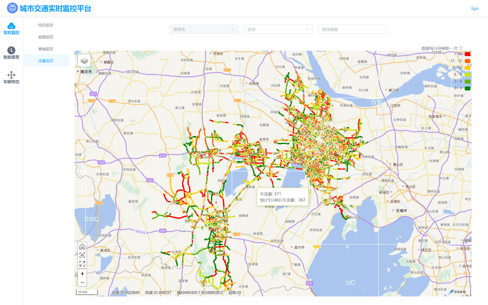
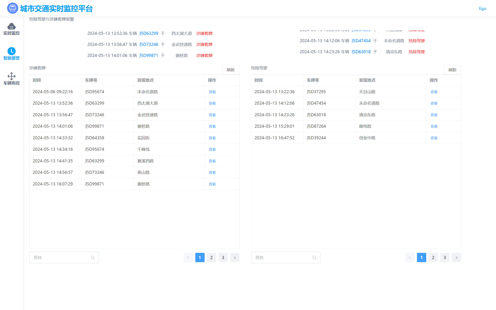
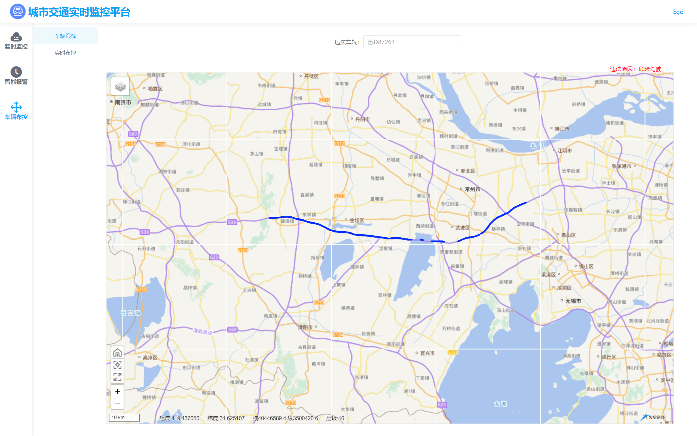
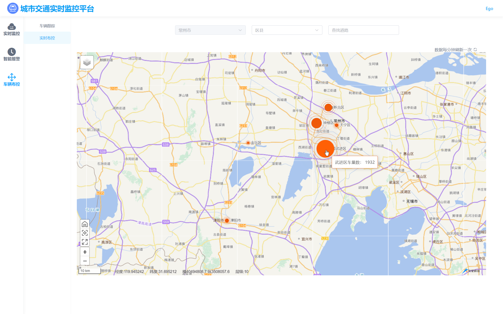

# TrafficFlowAnalysis

基于 Flink 的实时交通流分析预测系统。

Lambda 架构的实时交通数据处理平台，覆盖从数据采集、流式计算、混合存储、深度学习预测到 GIS 可视化展示的完整链路。系统以 Apache Flink 为流式计算引擎，集成 Kafka 消息队列、MySQL/HBase 混合存储、TCN 时空图卷积预测模型，以及 Spring Boot + Vue 的前后端分离架构，提供面向城市级交通管理的实时监控与智能决策辅助能力。

## 系统架构



> **图片类型：** 技术设计图。系统整体架构分为五个层次——数据采集与传输层（Kafka 集群）、数据处理与实时计算层（Flink 集群）、数据存储层（MySQL + HBase）、模型训练与预测层（PyTorch TCN），以及应用层（Spring Boot + Vue）。

## 模块划分

| 模块 | 定位 | 核心技术 |
| ---- | ---- | -------- |
| [`traffic-flink`](traffic-flink/README.md) | 实时流计算引擎 | Flink 1.13, CEP, 状态编程, 滑动窗口, Kafka, HBase |
| [`traffic-analysis`](traffic-analysis/README.md) | 数据服务层 | Spring Boot 2.6, MyBatis-Plus, HBase Client, Redis, JTS 空间计算 |
| [`traffic-front`](traffic-front/README.md) | 可视化交互层 | Vue 3, Vite 5, Mars2D GIS, ECharts, WebSocket |
| [`GCN-tffc`](GCN-tffc/README.md) | 流量预测引擎 | PyTorch Lightning, TCN, GCN, 时空图神经网络 |

**数据流向：** 交通卡口模拟器 → Kafka → Flink 实时计算 → MySQL（结构化结果）/ HBase（车辆轨迹）→ Spring Boot RESTful API → Vue GIS 可视化。GCN-tffc 离线训练，预测结果通过后端接口接入前端拥堵预测与流量预测页面。

## 技术亮点

**Lambda 架构的实时 + 离线双轨处理。** 实时链路基于 Flink 实现毫秒级流式计算，覆盖超速检测、套牌识别、危险驾驶 CEP 模式匹配、拥堵滑动窗口统计四种场景；离线链路基于 PyTorch Lightning 训练时空图卷积网络，挖掘历史交通数据的时空依赖规律，为未来流量预测提供模型支撑。两条链路在数据服务层汇合，通过统一的 RESTful API 暴露给前端。

**四种 Flink 计算模式的工程化应用。** 超速检测使用 RichFilterFunction + Guava Cache 实现限速值本地缓存，减少数据库查询压力；套牌识别基于 ValueState 状态编程追踪车辆跨卡口时间间隔；危险驾驶使用 Flink CEP 库定义 2 分钟内超速 3 次以上的复杂事件模式；拥堵监控使用 5 分钟滑动窗口（1 分钟步长）计算卡口平均车速与车流量。

**混合存储策略。** MySQL 存储结构化业务数据，利用关系型数据库的事务与关联查询能力；HBase 存储海量车辆轨迹，以车牌号为 RowKey 实现单行快速检索，列族设计天然适配轨迹数据的持续追加写入模式；Redis 作为缓存层承载 Session 管理与热数据加速。

**时空图卷积预测模型。** 将道路网络建模为图结构，在 TCN 的时间卷积块中嵌入 GCN 空间卷积层，同时捕捉交通流的时间依赖与空间关联。实现了 GCN、GRU、TGCN、TCN、MSTTGCN、TCGCN、NTCGCN 七种变体，采用扩张卷积实现指数级感受野增长。

**GIS 可视化与 WebSocket 实时推送。** 前端基于 Mars2D 实现多图层 GIS 地图渲染，叠加 ECharts 统计图层，支持卡口级、道路级、区县级三级下钻。实时报警模块通过 WebSocket 长连接，实现 Flink 违规检测结果到前端界面的秒级推送。

## 系统截图

### 综合监控面板



> 综合监控面板主界面，左侧为三级区域-道路-卡口索引树，中间为 Mars2D 地图视图（卡口标记点以颜色区分拥堵程度），右侧为实时统计面板。

### 超速监控



> 超速监控页面，以表格展示实时超速车辆列表，包含车牌号、卡口位置、道路名称、实际速度、限速值、拍摄时间，支持模糊搜索。

### 拥堵监控与预测



> 拥堵监控页面，以图表展示各区县/道路的实时拥堵指数与预测拥堵指数。拥堵指数公式：CI = (Vf / Vc) × (Q / C)。

### 流量监控与预测



> 流量监控页面，展示 Flink 实时计算得到的道路车流量情况以及 TCN 模型预测的未来车流量。

### 实时智能报警



> WebSocket 实时推送的智能报警页面，分为"涉嫌套牌"和"危险驾驶"两个标签页，点击可跳转至轨迹跟踪。

### 车辆轨迹跟踪



> 车辆轨迹跟踪页面，在地图上以折线绘制目标车辆的历史行驶轨迹，数据来源于 HBase。

### 车辆实时布控



> 车辆实时布控页面，展示各区县、道路的实时车辆分布，支持地图快速定位拥堵点。

## 技术栈

| 层级 | 技术选型 |
| ---- | -------- |
| 消息队列 | Apache Kafka 2.x（3 Broker 高可用集群） |
| 流式计算 | Apache Flink 1.13.6（DataStream API, CEP, ProcessFunction, Sliding Window） |
| 关系型存储 | MySQL 8.0（Druid 连接池, MyBatis-Plus ORM） |
| 列族存储 | Apache HBase 2.4（ZooKeeper 协调, RowKey 前缀扫描） |
| 缓存 | Redis（Session 共享, 数据模拟器车牌库） |
| 深度学习 | PyTorch 1.10, PyTorch Lightning 1.5（TCN, GCN, 时空图神经网络） |
| 后端框架 | Spring Boot 2.6.1（RESTful API, AOP, Spring Mail, MapStruct） |
| 前端框架 | Vue 3.2（Composition API）, Vite 5.2, Element Plus 2.2 |
| 地图引擎 | Mars2D 3.2（Leaflet GIS）, ECharts 可视化 |
| 集群基础 | Hadoop 3.x, ZooKeeper 3.x, CentOS 7.2 三节点集群 |

## 项目结构

```
TrafficFlowAnalysis/
├── traffic-flink/          # Flink 实时流计算模块
├── traffic-analysis/       # Spring Boot 后端 API 模块
├── traffic-front/          # Vue 3 前端可视化模块
├── GCN-tffc/              # PyTorch 交通流量预测模块
├── docs/                  # 文档与图片资源
└── README.md
```

## 许可

本项目为毕业设计作品，仅供学习与交流。