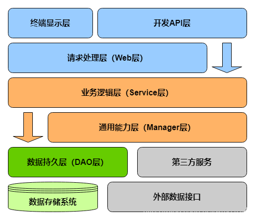

# traffic-analysis

数据服务层。基于 Spring Boot 构建的 RESTful API 服务，作为 Flink 实时计算层与前端可视化层之间的数据中枢，提供交通数据查询、用户认证、车辆轨迹检索、空间数据查询以及预测数据接入等能力。

## 分层架构



> **图片类型：** 技术设计图。三层架构：Controller 层处理 HTTP 请求，Service 层承载核心业务逻辑，Mapper 层通过 MyBatis-Plus 完成数据持久化。AOP 组件提供登录校验与参数验证。

### Controller 层

接收 HTTP 请求，完成参数校验与格式转换，调用 Service 层执行业务逻辑，返回 `Result` 统一响应体。全局异常处理统一拦截未捕获异常，返回标准错误格式。所有接口路径以 `/api` 为上下文前缀。

### Service 层

核心业务逻辑所在。采用面向接口编程，每个 Service 接口对应一个 `*ServiceImpl` 实现类。`HbaseServiceImpl` 封装 HBase 的 Scan、Get、Put 操作，屏蔽底层 HBase Client API 的复杂性。

### Mapper 层

基于 MyBatis-Plus 的 `BaseMapper<T>` 提供通用 CRUD 能力，复杂查询通过 XML 映射文件定义。`GeometryTypeHandler` 作为自定义 TypeHandler 处理 WKT 格式的 GEOMETRY 类型与 Java 对象之间的双向转换。

### AOP 横切关注点

- `GlobalInterceptor`：拦截需要登录的接口，从 Redis 中校验 Session 有效性
- `GlobalOperationAspect`：环绕通知记录接口调用日志（请求参数、执行时间、返回状态）

## API 设计

应用端口 `630`，上下文路径 `/api`。

### 用户管理


| 方法 | 路径 | 说明 |
| ---- | ---- | ---- |
| POST | `/api/userInfo/login` | 用户登录，返回 Token 写入 Redis Session |
| POST | `/api/userInfo/register` | 用户注册，邮箱验证码校验 |
| POST | `/api/userInfo/logout` | 登出，清除 Redis Session |
| POST | `/api/userInfo/resetPwd` | 重置密码 |
| POST | `/api/userInfo/checkCode` | 发送/校验邮箱验证码 |

### 交通数据查询

| 方法 | 路径 | 说明 |
| ---- | ---- | ---- |
| GET | `/api/czRoad/page` | 道路分页查询，支持多条件筛选 |
| GET | `/api/czRoad/searchRoad` | 道路搜索，返回包含 WKT 几何数据的完整信息 |
| GET | `/api/monitor/page` | 卡口分页查询 |
| GET | `/api/speeding/page` | 超速记录分页查询 |
| GET | `/api/violationList/*` | 违法车辆列表（套牌 + 危险驾驶） |

### 轨迹与预测

| 方法 | 路径 | 说明 |
| ---- | ---- | ---- |
| GET | `/api/track/{car}` | 根据车牌号从 HBase 检索车辆完整轨迹 |
| GET | `/api/averageSpeed/*` | 历史车流量与拥堵指数查询 |
| GET | `/api/predict/*` | 预测车流量与拥堵指数查询 |

## 关键技术实现

### HBase 轨迹检索

`HbaseServiceImpl` 以车牌号作为 RowKey 前缀执行 HBase Scan，使用 `PrefixFilter` 过滤无关行。HBase 配置通过 `HBaseConfig` 自动装配，ZooKeeper Quorum、端口等参数从 `application.properties` 注入。

### 空间数据处理

道路信息表 `cz_road` 的 `the_geom` 字段为 GEOMETRY 类型，存储道路的 WKT 几何数据。`GeometryTypeHandler` 作为 MyBatis 自定义 TypeHandler，在数据库 GEOMETRY 类型与 Java JTS `Geometry` 对象之间进行双向转换。

### 缓存与 Session

- Redis 作为 Session 共享存储，`session timeout = 60min`
- `@EnableCaching` 开启 Spring Cache 抽象
- `RedisConfig` 配置了自定义 `RedisTemplate` 序列化方式

### 数据库连接池

Druid 连接池提供 SQL 执行监控、慢查询日志、连接泄漏检测等运维能力。

## 数据库设计

系统使用 MySQL 8.0 存储结构化业务数据，核心表包括：

| 表名 | 说明 | 关键字段 |
| ---- | ---- | -------- |
| `t_monitor_info` | 交通卡口信息 | monitor_id, road_id, speed_limit, area_id, the_geom |
| `cz_road` | 道路信息 | id, osm_id, name, maxspeed, oneway, the_geom |
| `area_info` | 区县信息 | area_id, area_name |
| `t_speeding_info` | 超速记录 | car, monitor_id, road_id, real_speed, limit_speed, action_time |
| `t_violation_list` | 违法车辆 | car, violation, create_time |
| `t_average_speed` | 车流量统计 | start_time, end_time, monitor_id, avg_speed, car_count |
| `user_info` | 用户信息 | user_id, nick_name, email, password |

HBase 表 `vehicle_trajectory` 以车牌号为 RowKey，列族 `track` 存储车辆通过各卡口的时间、速度等轨迹数据。

## 依赖

| 组件 | 版本 | 用途 |
| ---- | ---- | ---- |
| Spring Boot | 2.6.1 | 应用框架 |
| MyBatis-Plus | 3.5.1 | ORM |
| Druid | 1.2.16 | 数据库连接池 |
| HBase Client | 2.4.0 | HBase 读写 |
| Spring Data Redis | 2.6.1 | Redis 集成 |
| Spring Mail | 2.6.1 | 邮件发送 |
| MapStruct | 1.5.2 | 编译期对象映射 |
| FastJSON | 1.2.66 | JSON 序列化 |
| JTS | 1.13 | 空间几何数据 |
| AspectJ | 1.9.4 | AOP 切面 |
| Logback | 1.2.10 | 日志 |

## 本地开发

### 前置条件

- JDK 8
- Maven 3.x
- MySQL 8.0（`127.0.0.1:3306/traffic_flow_analysis`）
- Redis（`127.0.0.1:6379`）
- HBase 2.4 集群（ZooKeeper: `node1,node2,node3:2181`）

### 构建与运行

```bash
cd traffic-analysis
mvn clean package -DskipTests
mvn spring-boot:run
```

服务启动后访问 `http://localhost:630/api/`。

### 运行测试

```bash
mvn test
```

## 配置说明

核心配置集中在 `src/main/resources/application.properties`：

```properties
server.port=630
server.servlet.context-path=/api
spring.datasource.url=jdbc:mysql://127.0.0.1:3306/traffic_flow_analysis
spring.datasource.username=root
spring.datasource.password=root
spring.datasource.type=com.alibaba.druid.pool.DruidDataSource
spring.redis.host=127.0.0.1
spring.redis.port=6379
hbase.zookeeper.quorum=node1,node2,node3
hbase.zookeeper.property.clientPort=2181
```