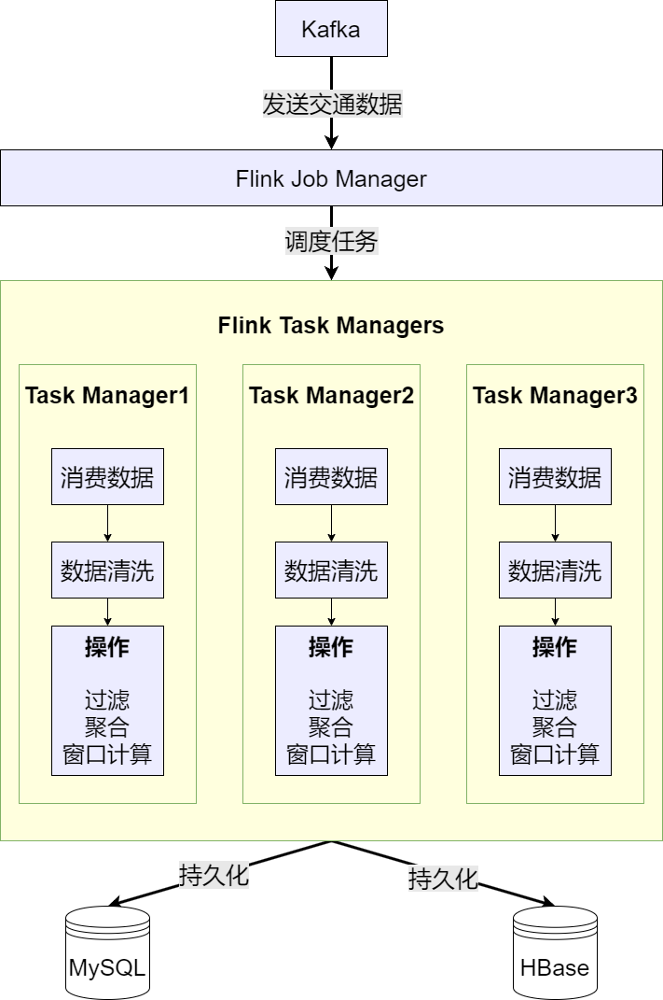
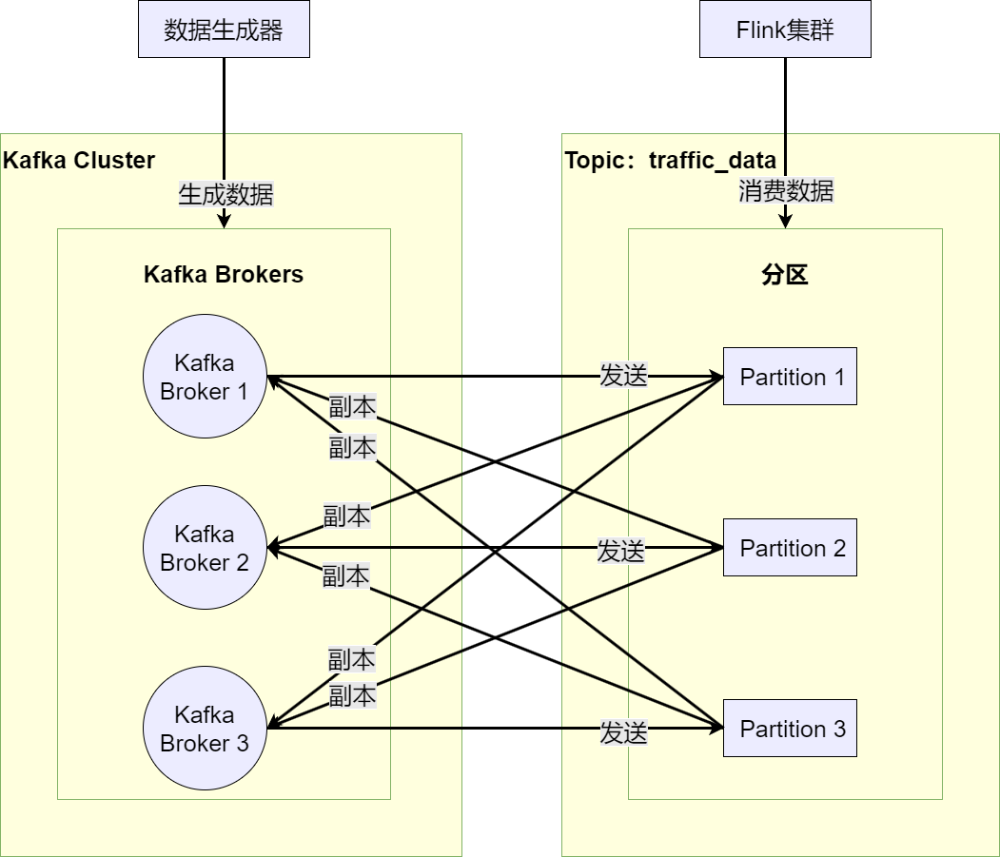
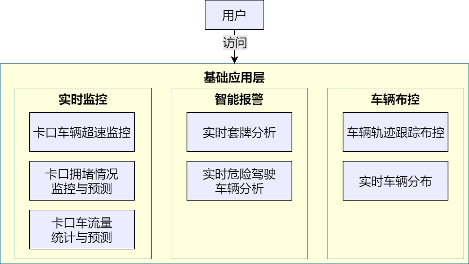

# traffic-flink

实时流计算引擎。基于 Apache Flink DataStream API 实现城市级交通卡口数据的实时处理，覆盖超速检测、套牌识别、危险驾驶 CEP 模式匹配、卡口拥堵滑动窗口统计四种计算场景，结果写入 MySQL 与 HBase，支撑上层应用实时监控与报警。

## 架构设计

Flink 应用以多线程模式并行运行四种计算任务，每个任务独立维护各自的 `StreamExecutionEnvironment`。数据源统一来自 Kafka 集群的 `topic-car` 主题，经过 JSON 解析、算子转换、结果输出三个阶段，最终写入 MySQL 和 HBase。



> **图片类型：** 技术设计图。Flink 集群结构：Job Manager 负责任务调度与资源分配，Task Manager 执行实际的流处理逻辑，包括数据清洗、过滤、聚合、窗口计算等操作。

```
Kafka (topic-car)
    │
    ├──→ OverSpeedController       → MySQL (t_speeding_info)
    ├──→ TaoPaiCarController       → MySQL (t_violation_list) + HBase (vehicle_trajectory)
    ├──→ DangerousDriverController → MySQL (t_violation_list)
    └──→ AverageSpeedMonitorController → MySQL (t_average_speed)
```

## 数据采集与传输



> **图片类型：** 技术设计图。数据模拟器生成 JSON 格式交通卡口数据，通过 Kafka Producer 发送至 `traffic_data` Topic。Kafka 集群采用 3 Broker 分布式架构，每个分区多副本保证高可用。Flink Consumer 从 Kafka 消费数据进行实时处理。

数据模拟器 `CheckPoint` 从 Redis 加载 5000 条真实车牌信息，从 MySQL 随机选取卡口 ID、道路 ID、区县 ID，在合理区间内随机生成车速，按统一 JSON 格式组装后发送至 Kafka。

## 计算任务

### 超速检测（`OverSpeedController`）

**算子链：** `Kafka Source → Map(JSON→MonitorInfo) → RichFilterFunction(超速判定) → JdbcSink`

- 限速值查询采用 Guava `LoadingCache` 本地缓存，最大 100 条，过期 100 分钟，将数据库查询频率从逐条降至首次命中
- 缓存未命中时，从 `t_monitor_info` 表查询对应卡口限速值，若卡口未设置限速则默认 60 km/h
- 超速阈值：实际速度 > 限速值 × 1.1（即超速 10%）
- `JdbcSink` 批量写入，batchSize=100，flush interval=5s，减少数据库连接开销

```java
public boolean filter(MonitorInfo monitorInfo) throws Exception {
    Integer speed_limit = cache.get(monitorInfo.getMonitorId());
    monitorInfo.setSpeedLimit(speed_limit);
    return monitorInfo.getSpeed() > speed_limit * 1.1;
}
```

### 套牌识别（`TaoPaiCarController`）

**算子链：** `Kafka Source → Map(JSON→MonitorInfo) → keyBy(car) → RichFlatMapFunction(状态判定) → JdbcSink`

- 使用 Flink 托管状态（`ValueState<MonitorInfo>`）追踪每辆车最近一次出现的时间戳与卡口 ID
- 判定逻辑：同一车牌号在 10 秒内被不同卡口识别 → 物理上不可能完成的位移 → 涉嫌套牌
- 状态由 Flink 自动管理，具备 Checkpoint 容错能力

```java
MonitorInfo _speedInfo = valueState.value();
valueState.update(speedInfo);
if (_speedInfo != null
    && speedInfo.getActionTime() - _speedInfo.getActionTime() < 10
    && speedInfo.getMonitorId() != _speedInfo.getMonitorId()) {
    collector.collect(new Violation(0, speedInfo.getCar(), "涉嫌套牌", System.currentTimeMillis()));
}
```

### 危险驾驶监控（`DangerousDriverController`）

**算子链：** `Kafka Source → Watermark(5s乱序) → keyBy(car) → CEP Pattern → Select`

- 使用 Flink CEP（Complex Event Processing）库定义危险驾驶行为模式
- 模式：同一车辆在 2 分钟时间窗口内，超速 20% 以上的事件出现 ≥ 3 次
- `AfterMatchSkipStrategy.skipPastLastEvent()` 保证已匹配事件不重复参与后续匹配
- 水印策略：`forBoundedOutOfOrderness(Duration.ofSeconds(5))`，容忍 5 秒数据乱序

```java
Pattern<MonitorInfo, MonitorInfo> pattern = Pattern.<MonitorInfo>begin(
    "first", AfterMatchSkipStrategy.skipPastLastEvent()
).where(new SimpleCondition<MonitorInfo>() {
    @Override
    public boolean filter(MonitorInfo value) throws Exception {
        int limitSpeed = 60;
        return value.getSpeed() > limitSpeed * 1.2;
    }
}).times(3).within(Time.minutes(2));
```

### 拥堵监控（`AverageSpeedMonitorController`）

**算子链：** `Kafka Source → Map(JSON→MonitorInfo) → keyBy(monitorId) → SlidingWindow(5min,1min) → WindowFunction → JdbcSink`

- 窗口类型：处理时间滑动窗口，窗口长度 5 分钟，滑动步长 1 分钟
- 聚合逻辑：每个窗口内计算 `avgSpeed = sum(speed) / count`，`carCount = count`
- 结果写入 `t_average_speed` 表（start_time, end_time, monitor_id, avg_speed, car_count）

## 数据存储



MySQL 存储结构化数据（卡口信息、违规记录、用户数据），HBase 存储海量车辆轨迹数据。Flink 通过 JDBC Connector 将计算结果写入 MySQL，通过 HBase Connector 将轨迹数据写入 `vehicle_trajectory` 表（RowKey=车牌号, 列族=track）。

## 依赖

| 组件 | 版本 | 用途 |
| ---- | ---- | ---- |
| Apache Flink | 1.13.6 | 流式计算引擎 |
| Flink CEP | 1.13.6 | 复杂事件处理 |
| Flink Kafka Connector | 1.13.6 | Kafka Source |
| Flink JDBC Connector | 1.13.6 | MySQL Sink |
| Flink HBase Connector | 1.13.6 | HBase 轨迹存储 |
| MySQL Connector | 8.0.26 | JDBC 驱动 |
| Jedis | 2.9.0 | Redis 客户端 |
| FastJSON | 2.0.32 | JSON 序列化 |
| Lombok | 1.18.24 | 代码生成 |
| Hutool | 5.8.20 | 通用工具集 |

## 本地开发

### 前置条件

- JDK 8
- Maven 3.x
- Kafka 集群（`node1.itcast.cn:9092, node2.itcast.cn:9092, node3.itcast.cn:9092`）
- MySQL 8.0（`127.0.0.1:3306/traffic_flow_analysis`）
- Redis（`127.0.0.1:6379`）
- HBase 2.4（ZooKeeper: `node1,node2,node3:2181`）

### 构建与运行

```bash
cd traffic-flink
mvn clean package
mvn exec:java -Dexec.mainClass="com.egon.App"
```

### 运行测试

```bash
mvn test
```

## 配置说明

集群连接信息硬编码在各 Controller 的 `main()` 方法中：

- Kafka Bootstrap Servers: `node1.itcast.cn:9092, node2.itcast.cn:9092, node3.itcast.cn:9092`
- Kafka Topic: `topic-car`，Consumer Group: `group1`（拥堵监控使用 `car-group2`）
- MySQL: `jdbc:mysql://127.0.0.1:3306/traffic_flow_analysis`（`root/root`）
- 超速阈值：限速值 × 1.1
- 套牌时间窗口：10 秒
- 危险驾驶：2 分钟 / 3 次 / 超速 20%
- 拥堵窗口：5 分钟长度 / 1 分钟步长